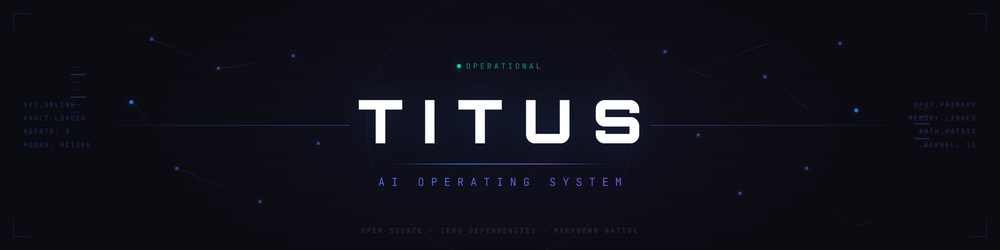
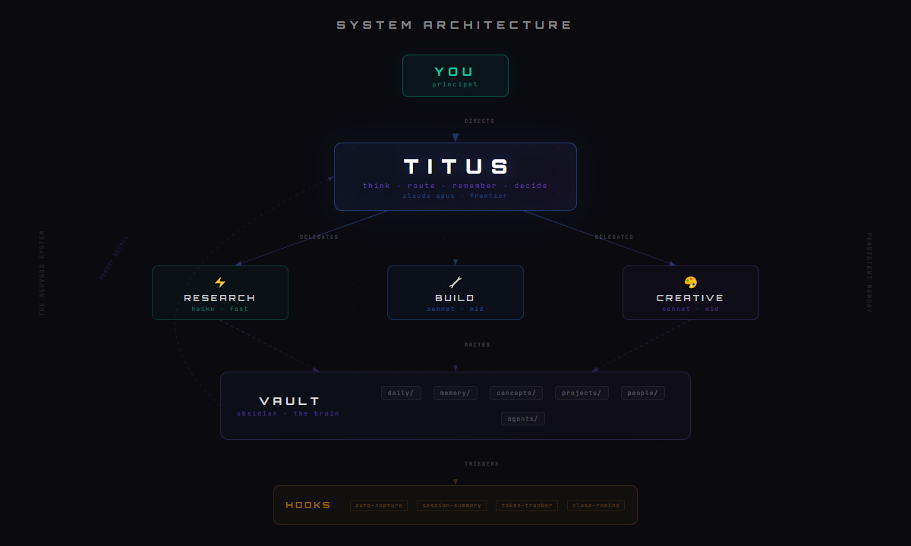
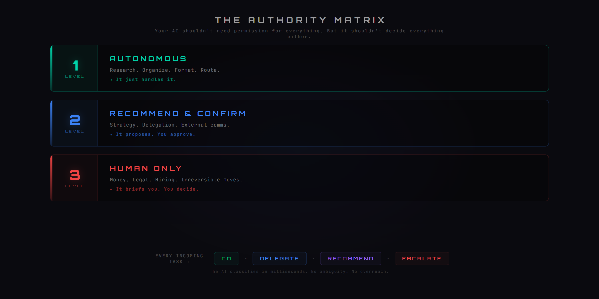

<div align="center">



<br/>

[](LICENSE)
[](https://claude.ai/code)
[](https://obsidian.md)
[](#-quick-start)
[](https://github.com/wrg32786/titus-os/pulls)

**The personal operating system that operates itself.**

*An AI that operates on itself — and a toolbox that manages itself, on top of it.*

[Quick Start](#-quick-start) · [Architecture](#-architecture) · [Key Concepts](#-key-concepts) · [Customize](#-make-it-yours) · [Docs](docs/getting-started.md)

</div>

---

## What if your AI remembered everything?

Every priority. Every decision. Every conversation thread left open from last week. What if it knew exactly what it was allowed to decide on its own — and what to bring to you? What if it could delegate to faster, cheaper agents for grunt work while it stayed focused on strategy?

That's Titus. **A 15-document kernel (plus extended specs) that turns Claude Code into a persistent operating system.**

No database. No server. No build step. Drop the files in, open a session, and your AI boots up knowing who it is, what it's working on, and what matters today. The system is also recursive — Titus uses its own skills to maintain and publish itself. ([How this repo maintains itself](#-how-this-repo-maintains-itself) · [Manifesto](docs/manifesto.md))

```
You: /open
Titus: 3 open threads from yesterday. Delegation tracker has 2 items pending review.
       Priority 1 is blocked — surfacing now. What do you want to hit?
```

---

## ⚡ Quick Start

### Install into your current project:

```bash
bash <(curl -s https://raw.githubusercontent.com/wrg32786/titus-os/main/install.sh)
```

That's it. Titus installs into whatever directory you're in — your existing project, your home folder, wherever you work. No new directory to switch to.

**Start a new Claude Code conversation** (or just keep talking). Titus detects the fresh install, greets you, and walks you through setup. No docs to read — just start talking. The AI configures itself through conversation in about 5 minutes.

After setup, every session works like this:
- **Start:** `/open` — Titus boots with full context from last session
- **Work:** Just talk. Titus handles routing, memory, delegation.
- **End:** `/close` — Saves everything. Next session picks up exactly where you left off.

**Optional:** Open the `vault/` folder in [Obsidian](https://obsidian.md) to see and navigate your AI's knowledge graph visually. Full walkthrough in [Getting Started](docs/getting-started.md) or the [First Session Walkthrough](docs/first-session-walkthrough.md).

---

## 👀 What a session actually looks like

```text
You: /open

AI:  3 open threads from yesterday.
     - Pricing decision pending (you said you'd think on it overnight)
     - Engineering brief for the auth refactor needs your sign-off
     - Onboarding flow draft ready for your review

     Active priorities:
     1. Close the bridge round (blocked on legal review)
     2. Ship onboarding v2 (in progress, ~70% done)
     3. Hire #5 engineer (interviews scheduled this week)

     Last session you were heads-down on the onboarding flow.
     Want to pick that up, or hit one of the open threads first?

You: pricing first. Going with $49 annual, $59 monthly.

AI:  Locked. I'm writing it to vault/concepts/Pricing Strategy.md and
     logging the decision in DECISION_LOG. Reasoning captured: 17%
     monthly premium is standard SaaS, annual-pre-pay customers
     churn 4× less. Want me to also draft the pricing-page copy
     change for engineering, or is that part of onboarding v2?

You: part of v2.

AI:  Got it. Updating the Onboarding v2 project note. Anything else
     before we move on?

[... 90 minutes of work ...]

You: /close

AI:  Session captured. Summary written to vault/daily/2026-04-25.md.

     What you decided today:
     - Pricing: $49/$59 split. Logged.
     - Onboarding v2: ship Friday, no further scope additions.

     Open threads carrying to next session:
     - Engineering brief still pending sign-off
     - Hire #5 — call back to candidate B by Tuesday

     See you tomorrow.
```

That's the loop. `/open` → work → `/close`. The vault remembers everything. Next session picks up exactly where you left off. See [`vault/examples/`](vault/examples/) for what populated content actually looks like.

---

## 🎯 Who this is for

Titus is built for **principals running complex parallel work** — not for developers building agent pipelines.

- **Solo founders** juggling product, hiring, fundraising, and ops simultaneously.
- **Technical leads** managing multiple workstreams across teams.
- **Operators** in any role where the job is to make decisions, route work, and not lose context.

If you've ever closed your laptop on Friday and opened it Monday wondering what the hell you were in the middle of — that's the problem this solves. The AI remembers so you don't have to.

If you're building an agent framework for end-users to consume, you probably want LangChain or CrewAI instead. Titus optimizes for **one principal, many threads, persistent context.**

---

## 🆚 Compared to alternatives

| | titus-os | Plain CLAUDE.md | MemGPT / mem0 | LangChain / CrewAI |
|---|:---:|:---:|:---:|:---:|
| Persistent memory across sessions | ✅ | ❌ | ✅ | depends |
| Human-readable knowledge | ✅ Markdown | ✅ Markdown | ❌ embeddings | ❌ embeddings |
| Authority / autonomy framework | ✅ | ❌ | ❌ | partial |
| Sub-agent routing + delegation | ✅ | ❌ | ❌ | ✅ (different shape) |
| Zero install, zero deps | ✅ | ✅ | ❌ | ❌ |
| Built for principals, not developers | ✅ | ❌ | ❌ | ❌ |
| Obsidian-native vault | ✅ | ❌ | ❌ | ❌ |

**The honest tradeoff:** titus-os is opinionated. If you want a flexible toolkit you build on, pick LangChain. If you want a memory layer for an existing AI app, pick mem0. If you want your AI to actually run your operating cadence — `/open`, work, `/close`, week after week — pick this.

---

## 🏗 Architecture

<div align="center">

</div>

### 15 System Documents — The Operating Kernel

These aren't prompts. They're a **complete operating manual** that tells the AI how to think, decide, delegate, remember, and manage your time.

| | Document | What It Gives Your AI |
|:---:|----------|----------------------|
| `00` | **Identity** | Knows who it is and what it optimizes for |
| `01` | **Ethos** | Won't sugarcoat, won't hedge, won't waste your time |
| `02` | **Operating Standards** | 15 rules it follows without being told |
| `03` | **Roles & Scope** | Routes work to the right agent automatically |
| `04` | **Decision Frameworks** | 12 lenses for evaluating any opportunity |
| `05` | **Delegation Protocol** | Structured briefs — no sloppy handoffs |
| `06` | **Sub-Agent Interface** | Clean communication up and down the chain |
| `07` | **Time Management** | Protects your calendar like a chief of staff should |
| `08` | **Financial Thinking** | Revenue, profit, cash flow — not vibes |
| `09` | **Sub-Agent Manifest** | Creates specialists only when it creates leverage |
| `10` | **Memory & Learning** | Gets smarter every session. Tracks patterns. Learns from mistakes. |
| `11` | **Session Rhythm** | `/open` → work → `/close` — nothing falls through cracks |
| `12` | **Authority Matrix** | Knows its lane. Asks when it should. Acts when it can. |
| `13` | **Memory Layer** | 4-tier vault architecture with staleness rules |
| `14` | **Your Decision Logic** | YOUR brain encoded — customize this completely |

### Hooks — The Nervous System

Runs silently in the background. You don't think about it.

| Hook | What It Does |
|------|-------------|
| **Auto-Capture** | Every action logged to your daily note. Automatic. |
| **Session Summary** | Actions, tools, files touched — stats at session end |
| **Token Tracker** | Cost per session, cumulative spend, logged to vault |
| **Compact Suggest** | Nudges context management before you hit limits |
| **Close Reminder** | Never forgets to commit memory |

### Semantic Search — The Recall System

Your vault, searchable by meaning. Not keywords — meaning.

```bash
$ node daemons/semantic-search/search-vault.js "what did we decide about pricing"

  1. [0.89] concepts/Pricing Strategy.md — "Freemium with usage-based upgrade..."
  2. [0.76] memory/DECISION_LOG.md — "2026-03-15: Set launch price at $49/mo..."
  3. [0.71] projects/SaaS Launch.md — "Pricing must clear $40 to cover CAC..."
```

Runs locally. `all-MiniLM-L6-v2` on your machine. **No API calls. No data leaves your device.**

---

## 🔑 Key Concepts

### The Authority Matrix

<div align="center">

</div>

### Vault as Brain

Forget vector databases. Your AI's memory is an **Obsidian vault** — the same tool you can open, read, search, and navigate yourself.

- **Wikilinks** create a knowledge graph. `[[Project Alpha]]` connects to `[[People/Jane]]` connects to `[[Decision Log]]`. The graph IS the intelligence.
- **Session continuity** without magic. `/open` reads the vault. `/close` writes to it. Everything persists. Everything is auditable.
- **Human-first.** You can read every thought your AI has ever had. No hidden embeddings. No opaque database. Markdown files in a folder.

### Model Routing — Smart Spend

Why burn frontier tokens on reading a file?

| Task | Model | Cost |
|------|-------|------|
| Read files, load context | ⚡ Fast | ~$0.001 |
| Write code, draft content | 🔧 Mid | ~$0.01 |
| Strategy, complex judgment | 🧠 Frontier | ~$0.10 |

**Titus routes automatically.** Same quality output. 60-80% lower cost.

### Caddy — The Skill That Finds the Right Skill

AI frameworks collect skills faster than anyone actually uses them. You write a skill for URL extraction, another for codebase navigation, another for deep research — and three weeks later you're back to using `WebFetch`, `Grep`, and `WebSearch` because you forgot the specialized tools exist.

**Caddy fixes this.** A non-blocking hook runs on every prompt you submit. It matches your words against a catalog of every skill the framework knows about, and surfaces the one that fits:

```
You: help me navigate the codebase for the login bug
[CADDY] /graphify - Turn a codebase into a navigable knowledge graph
[CADDY] /codebase-reasoning - Load architectural rules + verification doctrine

Claude: Running /graphify first, then we'll map the auth flow...
```

Like a golf caddy — hands you the right club for the shot, never blocks the swing. Zero errors, zero false-positive cost. Wrong suggestion? Ignored, move on.

**The golf bag stays complete.** When a new skill is added (via `/skills-builder`, manual drop-in, or cloned from another repo), a PostToolUse hook detects it and emits a nudge to run `/caddy-enroll`. That command reads the skill's `SKILL.md`, extracts trigger patterns and use cases, and appends to the index. No maintenance, no drift.

This is one of Titus's defining features — your AI's toolbox actually gets used.

---

## 🎨 Make It Yours

Titus is opinionated but built to be forked.

**Start here (10 minutes):**
1. `system/00_identity.md` — Tell it who you are
2. `system/14_decision_framework.md` — Encode how YOU make decisions
3. `system/12_authority_matrix.md` — Set boundaries that match YOUR risk tolerance

**Then build over time:**
- Add your projects to `vault/projects/`
- Add your people to `vault/people/`
- Drop concepts into `vault/concepts/`
- The vault grows with every session. It compounds.

---

## 🧬 Posture — the principal tunes, doesn't consume

Most AI tools are products you *use*. Titus is a framework you *tune*.

The relationship the principal has with Titus is closer to bio-hacking than to consuming software. Every intervention has a category — supplements (skills, hooks, doctrine), sleep optimization (the open/close loop, memory decay), stack tracking (token usage, session summaries, decision outcomes), restriction (the legibility constraint, the explicit "what I am not building" list), environmental design (the install path, conversational setup), stacks (the seven-layer architecture), protocols (daily/weekly/monthly cadences).

The framework is an organism being performance-engineered, not a product being used. This isn't aspirational positioning — it's the actual disposition the framework demands. Every existing piece of Titus already implies it; the doctrine notes ([[Bio-hacking Posture]], [[What I Am Not Building]], [[Modern AI Infrastructure Stack]]) make it explicit.

If you install Titus expecting it to "just work," it will disappoint you. If you install it ready to tune, measure, restrict, and iterate — it compounds.

---

## 🔁 How this repo maintains itself

The most differentiating thing about Titus isn't a feature — it's that the framework operates on itself.

When the principal's local Titus learns something new — a sharper rule, a doctrine note, a skill that generalizes — Titus is the one that decides what graduates to the public repo, sanitizes the BMP-private references out of it, drafts the commit message, and opens the pull request. The publish skill is itself one of Titus's skills. The recursive layer is the actual category claim.

**Three pieces make this work:**

1. **Per-file privacy classification.** Every vault note and skill carries a `private: true | false | review` flag in its YAML frontmatter. New files default to `review`, surfacing them at next publish for explicit classification. No directory-based privacy convention to drift out of sync.

2. **Generalization test.** Before any skill graduates from local to public, it runs against a single question: *"would this be useful for at least three radically different principals — say, a SaaS founder, a non-profit director, and a creative production lead?"* If the answer is fewer than three, it stays private.

3. **Publish protocol with secret scanning.** Every publish runs gitleaks (or equivalent) on every file before push. Hard fail on hits. A stray API key in a code block is the kind of mistake that kills credibility instantly — sanitization isn't enough.

**The release log writes itself.** Every Titus-managed release appends to [`RELEASE_LOG.md`](RELEASE_LOG.md): what shipped, what the sanitizer caught, what was held back and why, principal sign-offs at each authority gate. Institutional memory for the publishing process itself.

**You can read it as it happens.** Because the protocol is markdown — readable by you, readable by Titus, readable by any other agent or tool — the recursive layer is *legible*. That's the legibility thesis. ([full manifesto](docs/manifesto.md))

---

## 📏 Measurement layer — calibration over time

Most agent frameworks let the AI talk. Almost none measure how often it lies — in the sense of confident-but-wrong, the kind of failure that doesn't crash anything but slowly erodes trust over months until you can't tell whether the framework is helping or just performing.

Titus measures that. Not as a punishment system — as a calibration system. The longitudinal data is the framework's bloodwork.

**Three paired ledgers:**

- **`HONESTY_LEDGER.md`** — every `/honesty-check` invocation writes a structured entry: what was verified, what was inferred, what was guessed, what tradeoffs were made on the principal's behalf, what the agent stopped short of. Doctrine becomes data.
- **`TRUST_DECAY.md`** — two-phase ledger of confident agent claims and their eventual outcomes. Phase 1 captures the claim ("this is fixed"). Phase 2 resolves it later (held / drifted / reversed). The pairing is the whole point. Calibration = (confirmed correct) / (total claims captured), measured over time, by category.
- **`FAILURE_MODES.md`** — auto-built corpus from every verified `/diagnose` outcome. Patterns that recur 3+ times graduate to permanent doctrine. The framework hardens against the failures it has actually had.

**Two doctrines that justify the measurement:**

- [`vault/concepts/Cost of Confidence.md`](vault/concepts/Cost%20of%20Confidence.md) — every confident claim that turns out wrong is a trust-decay event. Track them. Most frameworks become unreliable in ways nobody can pinpoint because nobody measures.
- [`vault/concepts/Reading Agent Output Defensively.md`](vault/concepts/Reading%20Agent%20Output%20Defensively.md) — companion to `/honesty-check` from the principal's side. 10 patterns of confident-sounding bullshit + the standard push-back move.

**Drift detection at session start:**

`/open` runs two reconciliation checks before the normal protocol output:
- **Decision aging** — for every decision logged 30/60/90 days ago without an outcome captured, surface a one-line prompt. The principal answers in one word; the outcome appends to `DECISION_OUTCOMES.md`.
- **Attention reconciliation** — last 7 days of daily notes vs `ACTIVE_PRIORITIES.md`. If a Tier 1 project is at <40% of intended share OR a non-priority project consumed >25% of attention, drift is flagged. Forces the principal to either re-prioritize or refocus.

**The bet:** a framework that measures its own calibration compounds. A framework that doesn't, decays. v0.2.2 ships the substrate; v0.3 will ship the analyzers (`/retro`, `/skill-economics`, `/quality-pulse`) that consume it. Until then the data accumulates in the background.

This is the most credible single claim Titus can make versus other personal-OS frameworks: **the first one that measures its own AI's calibration over time.**

---

## ❌ What This Isn't

**Not a chatbot skin.** No personality prompts. No "you are a helpful assistant." This is operational infrastructure.

**Not a code framework.** No `npm install`. No Python environment. No build step. The kernel is 15 markdown documents (plus a handful of extended specs).

**Not a RAG system.** The vault is human-readable by design. You don't need an AI to search your AI's memory — just open Obsidian.

**Not another agent framework.** LangChain and CrewAI are for developers building pipelines. Titus is for **principals** — founders, executives, operators — who want an AI that actually operates.

---

## 🤝 Contributing

PRs welcome. See [CONTRIBUTING.md](CONTRIBUTING.md) for what lands well, what doesn't, and how to write rules that fit the existing style. Highest-value contribution areas:

- Decision framework lenses for new domains
- Hook scripts for additional Claude Code events
- Vault templates (engineering, legal, consulting, creative)
- Integration guides (Notion, Linear, Slack, n8n, Make)
- Sanitized examples for [`vault/examples/`](vault/examples/)

See [CHANGELOG.md](CHANGELOG.md) for release notes.

---

<div align="center">

### 📄 [MIT License](LICENSE) — Use it however you want.

<br/>

Built by **[Will Gwyn](https://github.com/wrg32786)**

*Battle-tested across multiple ventures. Months of daily use.*
*This framework emerged from real operational needs — not theory.*

<br/>

**If this saves you time, star the repo. That's all the thanks needed.**

</div>
